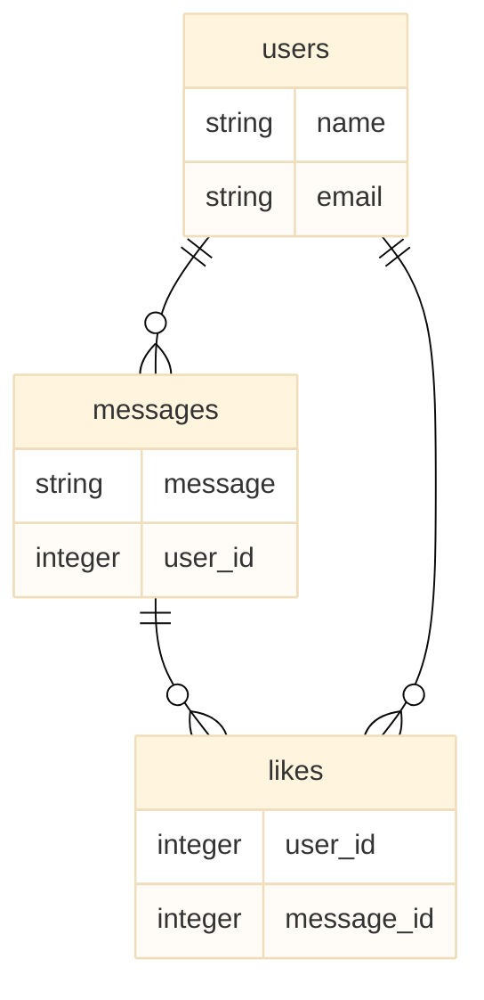

## ER図

```mermaid
%%{init:{'theme':'base'}}%%

erDiagram
users ||--o{ messages: ""
messages ||--o{ likes: ""
users ||--o{ likes: ""

users {
  string name
  string email
}

messages {
  string message
  integer user_id
}

likes {
  integer user_id
  integer message_id
}


```